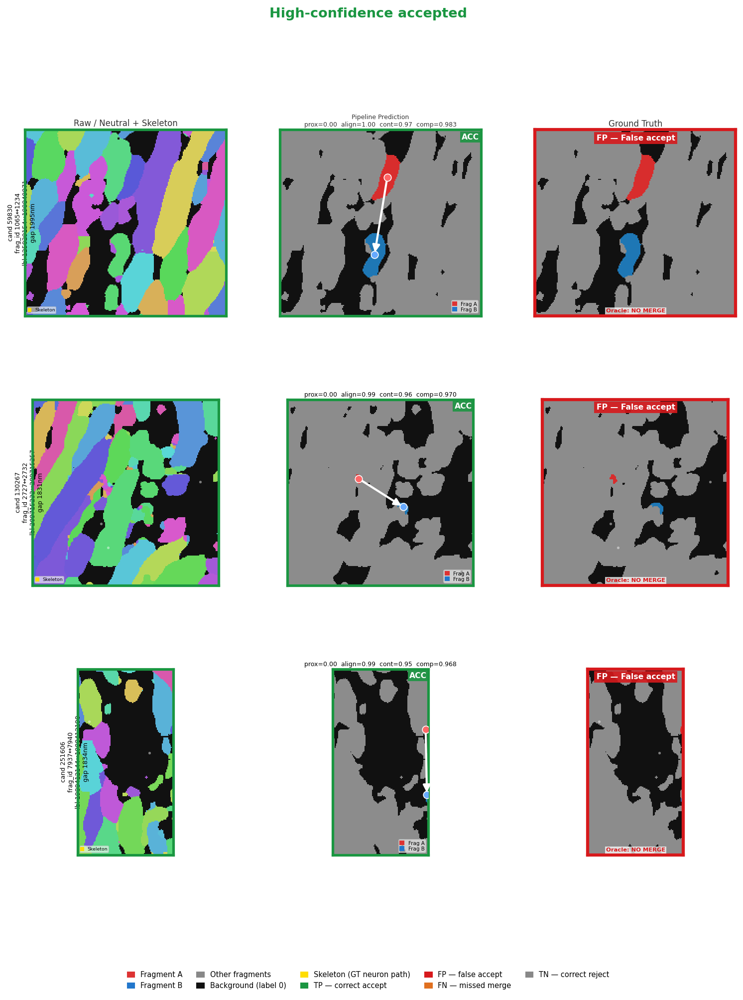
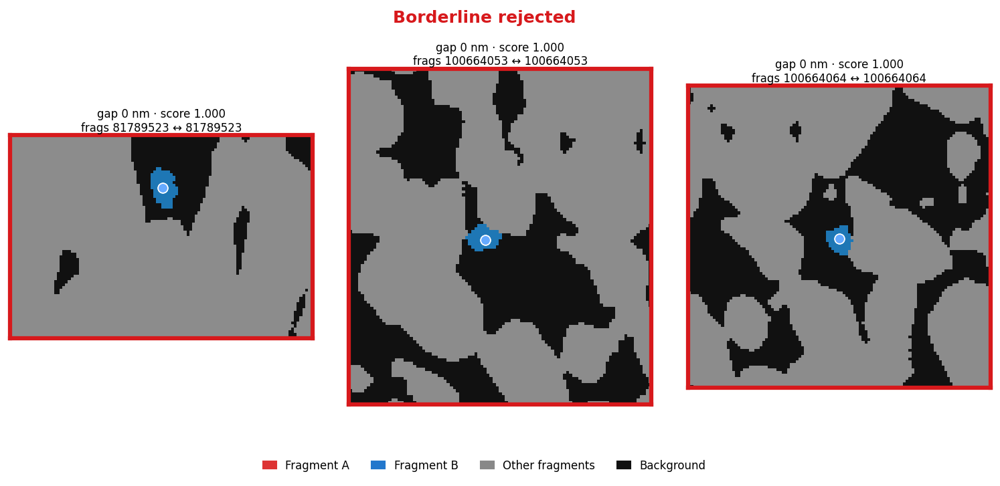

# Connectomics Post-Segmentation Pipeline

**CPSC 4900 Senior Project — Advisors: Dr. Xiuye Chen (Yale CS) and Dr. Aaron T. Kuan (Yale School of Medicine)**

A modular, conservative post-segmentation pipeline for large-scale connectomics data. Takes the output of automated segmentation workflows and produces graph-based connectivity representations suitable for downstream analysis, proofreading, and visualization in Neuroglancer.

**Design philosophy:** Conservative correctness over aggressive merging. Uncertainty is explicitly preserved, never discarded. Three-outcome validation (ACCEPT / REJECT / AMBIGUOUS) — ambiguous connections are flagged for human review rather than forced to a binary decision.

## Pipeline Overview

```
Segmentation Volume → Fragment Extraction → Graph Construction → Candidate Generation
    → Conservative Validation → Assembly → Export
```

1. **Fragment extraction** — connected components from segmentation volume, with TEASAR skeletonization to capture interior structure
2. **Graph construction** — skeleton-node KD-tree graph exposing interior splits along long axons; optional long-range endpoint pass for genuine segmentation gaps
3. **Candidate generation** — per-edge composite scoring (proximity, alignment, continuity, size) with distance-conditioned weight switching for long-range pairs
4. **Conservative validation** — seven configurable rules; hard-rejects are explicit and auditable
5. **Assembly** — merge accepted connections, detect topology issues (cycles, branching, ambiguity)
6. **Export** — CSV, GraphML, SWC, Neuroglancer annotations, corrected precomputed segmentation

## Validation Results

### CREMI Sample A (Drosophila EM)

| Metric | Value |
|--------|-------|
| Precision | **1.000** |
| Recall | **0.909** |
| F1 | **0.952** |

64×256×256 voxel crop, 40×4×4 nm resolution, ~800 neuron labels. Evaluation uses label-ID ground truth (pairs with the same GT label that appear as separate fragments). Best understood as a pipeline correctness check rather than a realistic proofreading benchmark, since the input is human-annotated labels rather than automated segmentation output.

### XPRESS Challenge (Mouse White Matter XNH)

| Split | GT pairs | Coverage | Recall | Precision |
|-------|-------------|----------|--------|-----------|
| Training (Exp 24) | 1,499 | 78.7% (1,180 reached candidate stage) | **0.9958** | ~0.003 |
| Held-out validation (Exp 24) | 203 | 81.3% (165 reached candidate stage) | **0.9879** | — |

Full 699³ voxel volume, 33 nm isotropic resolution, myelinated cortical axons. Evaluation uses skeleton-based ground truth (XPRESS challenge). This is the primary domain-appropriate benchmark — automated (imperfect) segmentation input, with true split errors along axon interiors that the pipeline must detect and propose to merge.

The held-out validation volume was never seen during development. The 5 remaining training false negatives and 2 validation false negatives all fail the CurvatureRule at gaps of 66–987 nm where the direction estimate is unreliable; no MinGapRule or SizeDiscrepancyRule false negatives remain. Low precision reflects the fundamental challenge of discriminating same-axon from different-axon long-range pairs at scale — see the precision-characterization analyses below.

## Precision Characterization (Experiments 26–28)

Three post-hoc analyses on the Experiment 24 training output localize the precision problem and bound what any gap-aware strategy can achieve. Each is reproducible from the shipped `connections.csv` export without re-running the pipeline.

### Exp 26 — Precision is an order of magnitude worse in the long-range regime

| Gap bin (nm) | Candidates | TP | FP | Precision |
|--------------|-----------:|---:|---:|-----------|
| [300, 500)   | 20,418     | 594| 19,745  | **0.0292** (best) |
| [1500, 2000) | 222,788    | 203| 222,572 | **0.0009** (worst) |
| **Total**    | 369,570    | 1,248 | 366,933 | 0.0034 |

The `[1500, 2000)` nm bin alone contains **60.7% of all false positives** but only 16.3% of true positives. Validation reproduces the same shape, confirming this is a domain property (myelinated white-matter axon density), not a training-volume artifact. Regenerate with `python scripts/gap_stratified_precision.py`.

### Exp 27 — A neighborhood-density feature is a real but partial discriminator

For each accepted candidate, count other fragment centroids within a radius of the pair's midpoint. TP density is 25–28% lower than FP density on average at R = 1500 nm, and using density as a re-ranker gains:

| Recall target | Composite baseline | density\_max\_1500 | Relative gain |
|---------------|-------------------:|-------------------:|--------------:|
| 0.99          | 0.0034             | 0.0035             | +4%           |
| 0.90          | 0.0034             | 0.0045             | +33%          |
| 0.85          | 0.0033             | **0.0049**         | **+49%**      |

The effect decays sharply at recall 0.99 — density alone does not break the precision ceiling at the pipeline's operating point. Regenerate with `python scripts/neighborhood_density_reranker.py`.

### Exp 28 — The (composite, gap_bin) feature pair has a structural precision ceiling

A per-bin threshold allocation using ground truth labels to set the ceiling for *any* threshold-based strategy on these features:

| Recall target | Global baseline | Per-bin ceiling | Relative gain |
|---------------|----------------:|---------------:|--------------:|
| 0.99          | 0.0034          | 0.0034         | +1.3%         |
| 0.90          | 0.0034          | 0.0051         | +51%          |
| 0.85          | 0.0033          | 0.0068         | **+104%**     |
| 0.70          | 0.0032          | **0.0169**     | **+421%**     |

**At recall 0.99 the ceiling is nearly flat** — the hardest-to-recover 1% of TPs sit in the same gap bins as the FP mass, so no per-bin reallocation can help. This explains why Exp 20's ML filter could not maintain recall ≥ 0.99 with meaningful precision gain: it is a structural limit of (composite, gap_bin), not an ML-architecture failure. Meaningful high-recall precision improvement requires features *orthogonal* to this subspace — Exp 20's per-fragment-degree signal was one such feature and it reached 0.037 at recall 0.85, 5× above the per-bin ceiling of 0.007 at the same recall. Regenerate with `python scripts/per_bin_threshold.py`.

## What the Pipeline Sees

Each row below shows **three panels for one candidate pair**, sampled from the XPRESS training volume (699³ voxels, 33 nm isotropic). Same-label pairs (two fragments of the same segment, which trivially score 1.0) are excluded.

| Panel | Content |
|-------|---------|
| **Left — Neutral** | Distinct muted color per segment (no A/B bias) + yellow skeleton node/edge overlay showing where ground-truth neuron paths run through the tissue |
| **Center — Prediction** | Fragment A = red, Fragment B = blue; white arrow = proposed connection; ACC/REJ badge; all 5 component scores in title |
| **Right — Ground Truth** | Ground-truth verdict badge (TP/FP/FN/TN); bright yellow = skeleton of the relevant neurons; dashed line = GT crossing for true merge pairs; explicit "GT: SHOULD MERGE / NO MERGE" |

**High-confidence accepted** — the pipeline's strongest merge proposals (highest composite score, excluding same-label):



> The FP outcomes shown above reflect the pipeline's low-precision operating point: ~368,000 candidates are accepted to achieve ~99.6% recall on the 1,499 GT merge pairs. Geometrically compelling pairs are therefore predominantly false accepts at this threshold — a downstream ML filter (Experiment 20) is required when precision matters.

**Borderline rejected** — candidates the pipeline declined but which scored highest among rejections:



> All three show TN (correct rejections): the skeleton overlay in Panel 1 confirms no ground-truth axon crosses between the two fragments.

A full per-candidate PDF report (cover + all sampling categories + GT verdict on every row) can be regenerated at any time — see [Visual Validation Report](#visual-validation-report) below.

## Key Features

### Graph Construction (`skeleton_node` method)

Rather than indexing only TEASAR degree-1 endpoints, the `skeleton_node` method indexes **every skeleton node** from every fragment in a single KD-tree and batch-queries them. This exposes splits that occur in the interior of long axons — the primary error class in XPRESS, which an endpoint-only graph cannot represent by design.

An optional **long-range endpoint pass** adds a supplemental graph construction step that queries degree-1 endpoints at a larger search radius (`max_endpoint_search_nm`), targeting genuine segmentation gaps wider than the standard skeleton-node radius.

### Distance-Conditioned Scoring

The standard composite score (`0.35×proximity + 0.30×alignment + 0.25×continuity + 0.10×size`) is unreliable for long-range pairs where gap distance > ~1000 nm: proximity decays to near-zero, suppressing the composite score even when alignment and continuity are strong. The candidate generator supports a `long_range_weights` config that switches to a proximity-free weight vector (`0.45×alignment + 0.40×continuity + 0.15×size`) for pairs above a configurable distance threshold.

### Conservative Validation Rules

Seven built-in rules, each returning ACCEPT / REJECT / AMBIGUOUS with a confidence score:

| Rule | Description |
|------|-------------|
| `MinGapRule` | Reject candidates with gap below a minimum (disabled by default: `min_gap_nm=0`) |
| `MaxDistanceRule` | Hard-reject if gap exceeds physical distance limit |
| `CurvatureRule` | Reject if junction angle exceeds threshold; optionally skips check for long-range pairs where the endpoint-centroid direction estimate is unreliable (`skip_distance_nm`) |
| `DirectionReversalRule` | Reject if fragments point away from each other |
| `SizeDiscrepancyRule` | Reject if radius ratio is implausible |
| `BranchingLimitRule` | Reject if merge would connect to more already-accepted partners than a limit |
| `CompositeScoreRule` | Hard-reject if composite score falls below a minimum |

All rules are configurable via YAML and composable; the validation pipeline short-circuits on any hard REJECT.

## Installation

```bash
# Core installation
pip install -e .

# With all optional dependencies
pip install -e ".[all]"

# Development tools (pytest, black, mypy)
pip install -e ".[dev]"
```

**Requirements:** Python ≥ 3.10, NumPy, NetworkX, h5py, PyYAML, scikit-learn. Optional: kimimaro (TEASAR skeletonization), zarr, cloud-volume (Neuroglancer precomputed I/O).

## Quick Start

```bash
# Run on CREMI Sample A (requires data/cremi_crop.hdf)
connectomics-pipeline --config configs/cremi_sample_a.yaml

# Run on XPRESS training volume (requires data/xpress/baseline_seg_full.h5)
connectomics-pipeline --config configs/xpress_sample.yaml

# Run on XPRESS held-out validation volume
connectomics-pipeline --config configs/xpress_validation.yaml
```

## Configuration

All pipeline parameters are controlled via YAML config files. `configs/default.yaml` documents the full option set. Domain-specific configs:

- `configs/cremi_sample_a.yaml` — CREMI Drosophila EM (anisotropic, endpoint graph)
- `configs/xpress_sample.yaml` — XPRESS mouse white matter XNH (isotropic 33 nm, skeleton-node graph, long-range pass)
- `configs/xpress_validation.yaml` — same settings applied to the held-out validation volume

Key config sections:

```yaml
graph:
  construction_method: "skeleton_node"   # endpoint | skeleton_node
  max_distance_nm: 500                   # standard search radius
  max_endpoint_search_nm: 2000           # long-range pass radius (0 = disabled)

candidates:
  max_endpoint_distance_nm: 600          # proximity decay reference distance
  weights: {proximity: 0.35, alignment: 0.30, continuity: 0.25, size: 0.10}
  long_range_threshold_nm: 1000          # switch to proximity-free weights above this
  long_range_weights: {proximity: 0.00, alignment: 0.45, continuity: 0.40, size: 0.15}

validation:
  accept_threshold: 0.25
  reject_threshold: 0.15
  rules:
    - name: "CurvatureRule"
      params:
        max_curvature_deg: 150
        skip_distance_nm: 1000           # skip unreliable check for long-range pairs
```

## Project Structure

```
connectomics_pipeline/
├── io/              # Volume readers: HDF5, Zarr, Neuroglancer precomputed, NumPy
├── fragments/       # Fragment extraction, TEASAR skeletonization, meshing, stitching
├── graph/           # Skeleton-node and endpoint graph construction, KD-tree indexing
├── candidates/      # Composite scoring: proximity, alignment, continuity, size
├── validation/      # Seven configurable validation rules + report builder
├── assembly/        # Structure assembly, cycle detection, ambiguity flagging
├── postprocess/     # Post-validation filters (ML-based false-positive filter)
├── export/          # GraphML, CSV, SWC, Neuroglancer annotations, precomputed seg
├── evaluation/      # Ground truth evaluation: label-ID and XPRESS skeleton ground truth
├── visualization/   # Diagnostic plots and Neuroglancer annotation layers
└── utils/           # Config loading, types, spatial math, logging

scripts/
└── generate_visual_report.py   # Per-candidate 2D slice PDF report (see below)
```

## Output Formats

| Format | Config key | Description |
|--------|------------|-------------|
| CSV | `"csv"` | Fragment metadata, per-connection decisions, structure summaries |
| GraphML | `"graphml"` | Fragment adjacency graph for network analysis |
| SWC | `"swc"` | Neuron morphology in standard traced-neuron format |
| Neuroglancer annotations | `"neuroglancer"` | Line annotations (green/red/yellow per decision) as an annotation layer |
| Corrected precomputed seg | `"precomputed_seg"` | Segmentation volume with accepted merges applied, in Neuroglancer precomputed format |

## Visual Validation Report

`scripts/generate_visual_report.py` produces a multi-page PDF. Each candidate row shows three panels: **Neutral + skeleton overlay** | **Pipeline prediction** | **Ground truth**. Six categories are sampled:

| Category | Border color | Description |
|----------|-------------|-------------|
| **Ground-truth TP** | blue | Accepted AND GT-positive — the primary scientific check |
| High-confidence accepted | green | Highest composite score among accepted |
| Low-confidence accepted | orange | Lowest composite score among accepted |
| Borderline rejected | red | Highest composite score among rejected (hard cases) |
| GT FN | dark orange | Rejected but GT says should merge |
| Random rejected | gray | Random sample of rejected |

**Ground-truth semantics (XPRESS):** A candidate is GT-positive ("GT SHOULD MERGE") when its `(label_a, label_b)` pair appears in the skeleton-derived merge set. That set is built by `build_merge_oracle()` in `xpress_ground_truth.py`: for each axon skeleton edge whose endpoints map to *different* non-background segment IDs in the baseline segmentation, that `(seg_a, seg_b)` pair is added (edge-crossing criterion). The dashed line shown for TP/FN rows in Panel 3 is a GT-positive *indicator* connecting fragment centroids — it is not a direct rendering of the skeleton edge itself. To verify anatomical reality, inspect the yellow skeleton overlay in Panel 1 and Panel 3: the skeleton should visibly run through both fragment regions. Pipeline decisions are based on skeleton geometry (alignment, continuity, curvature scores) and rule-based filters; ground-truth labels play no role in the pipeline decision itself.

**The Ground-truth TP category is the most important scientific validation step:** it directly confirms that each pipeline-accepted merge is a real biological split — not just a metric count. For each blue-bordered row, verify that (1) the yellow skeleton in Panel 1 runs through both fragments, (2) the fragments look morphologically continuous in Panel 2, and (3) the skeleton visibly occupies both label regions in Panel 3 with the dashed GT-positive indicator.

This inspection is the final non-automated layer of end-to-end validation and should be run after any experiment that changes accepted-candidate composition.

The report also writes a `gt_pair_audit.csv` alongside the PDF (columns: `candidate_id`, `fragment_a`, `fragment_b`, `label_a`, `label_b`, `gt_should_merge`, `gt_source`, `status`, `composite`, `alignment`, `continuity`, `gap`) for programmatic downstream analysis.

```bash
# XPRESS training — ground-truth TP inspection (primary use case)
python scripts/generate_visual_report.py \
    --output-dir output/xpress_training \
    --seg data/xpress/baseline_seg_training.h5 \
    --seg-key volumes/segmentation_0.550 \
    --skel data/xpress/XPRESS_training_skels.npz \
    --resolution 33 \
    --out docs/visual_report_tp_inspection.pdf

# XPRESS validation set (requires seg-offset for the 252-voxel offset)
python scripts/generate_visual_report.py \
    --output-dir output/xpress_validation \
    --seg data/xpress/baseline_seg_validation.h5 \
    --seg-key volumes/segmentation_0.550 \
    --skel data/xpress/XPRESS_validation_skels.npz \
    --seg-offset 252 252 252 \
    --resolution 33 \
    --out docs/visual_report_tp_inspection_validation.pdf

# CREMI (anisotropic voxels + raw EM image for Panel 1)
python scripts/generate_visual_report.py \
    --output-dir output/cremi_sample_a \
    --seg data/cremi_crop.hdf \
    --seg-key labels \
    --raw data/sample_A_20160501.hdf \
    --raw-key volumes/raw \
    --resolution 40 4 4 \
    --out output/cremi_sample_a/visual_report.pdf
```

Key options: `--skel` (skeleton .npz for GT overlay — required for Ground-truth TP category), `--raw` / `--raw-key` (raw EM grayscale for Panel 1), `--seg-offset Z Y X` (voxel offset for sub-volume runs), `--crop-half` (default 100 → 200×200 voxel crop), `--z-half` (skeleton projection thickness, default 4 voxels), `--n-samples` (default 5 per category).

## Testing

```bash
pytest tests/                                                        # run all tests
pytest tests/ --cov=connectomics_pipeline --cov-report=term-missing  # with coverage
```

**428 tests**, passing on Python 3.10, 3.11, and 3.12. CI runs automatically on every push and pull request via GitHub Actions (`.github/workflows/ci.yml`): tests, black formatting check, and mypy type checking.

## Documentation

- [`ARCHITECTURE.md`](ARCHITECTURE.md) — Full system design, data flow, and module interfaces
- [`docs/EXPERIMENT_LOG.md`](docs/EXPERIMENT_LOG.md) — All pipeline runs with quantitative results (Experiments 1–28)
- [`docs/TESTING.md`](docs/TESTING.md) — Test structure, fixtures, and how to add tests
- [`docs/TESTING_PLAN.md`](docs/TESTING_PLAN.md) — Phase-by-phase validation strategy and status
- [`docs/gap_stratified_precision.csv`](docs/gap_stratified_precision.csv) + [`.png`](docs/gap_stratified_precision.png) — per-bin precision/recall analysis of the Experiment 24 training output (Experiment 26). Re-run with `python scripts/gap_stratified_precision.py`.
- [`docs/density_summary.csv`](docs/density_summary.csv) + [`density_pr_curve.png`](docs/density_pr_curve.png) + [`density_distribution.png`](docs/density_distribution.png) — neighborhood-density re-ranker evaluation (Experiment 27). Confirms density is a real signal (+49% precision at recall 0.85) but decays to +4–6% at recall 0.99. Re-run with `python scripts/neighborhood_density_reranker.py`.
- [`docs/per_bin_threshold_summary.csv`](docs/per_bin_threshold_summary.csv) + [`per_bin_threshold_pr.png`](docs/per_bin_threshold_pr.png) — per-bin threshold precision ceiling (Experiment 28). Establishes that the (composite, gap_bin) feature pair has a 1.3% ceiling at recall 0.99 and a 421% ceiling at recall 0.70. Re-run with `python scripts/per_bin_threshold.py`.

## References

- XPRESS Challenge — [github.com/htem/xpress-challenge](https://github.com/htem/xpress-challenge)
- Lin et al., 2021 — PyTorch Connectomics (arXiv:2112.05754)
- Dorkenwald et al., 2025 — CAVE (Nature Methods)
- MICrONS Consortium, 2025 — Functional Connectomics (Nature)
- Plaza & Funke, 2018 — Analyzing Image Segmentation for Connectomics (Frontiers in Neural Circuits)
